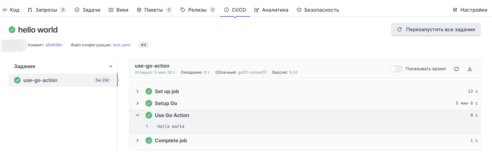
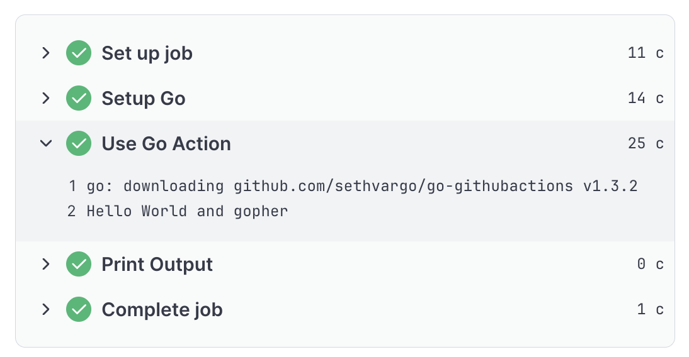
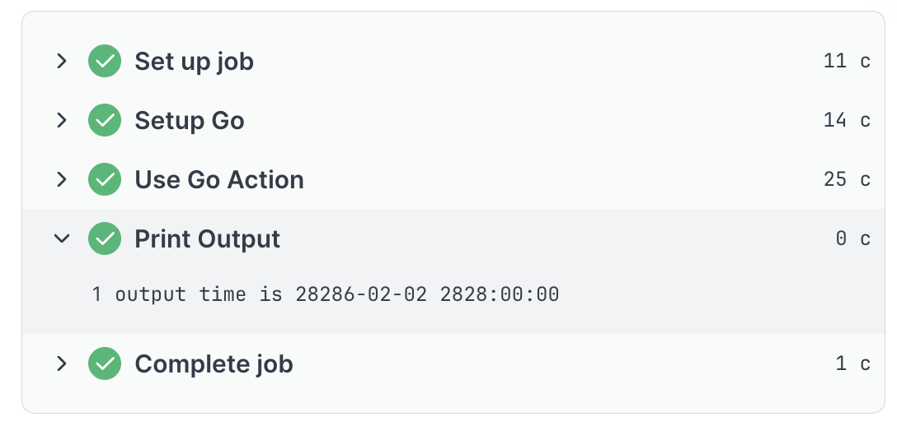

## Go-actions для GitVerse Actions: пошаговое руководство
Теги: GitVerse, CI/CD, Go, GitHub Actions, DevOps, Golang


Эта статья — практическое руководство по созданию собственных Go-экшенов для платформы GitVerse. Если вы хотите научиться писать action на Go и переиспользовать их в своих CI/CD-пайплайнах — тогда эта статья для вас.

### При чем тут GitHub Actions?
Прежде чем погружаться в GitVerse, давайте вспомним, что такое GitHub Actions. Это встроенная система автоматизации (CI/CD), которая позволяет запускать задачи прямо из репозитория. Многие с ней знакомы, но не все знают главного: экшены можно писать самостоятельно, а не только использовать готовые. <br>
GitHub предоставляет отличную документацию для начинающих — ознакомиться можно [здесь](https://docs.github.com/en/actions/tutorials).

### Чем интересен GitVerse?
GitVerse Actions — это встроенная система CI/CD, которая почти полностью совместима с GitHub Actions. Это значит, что ваш опыт работы с GitHub Actions во многом пригодится и здесь. <br>
Но есть кое-что, что делает GitVerse особенным. Мало кто знает, но на GitVerse можно создавать нативные экшены на Go, тогда как GitHub из коробки поддерживает только JavaScript (хотя вы всегда можете использовать Docker-контейнеры для любого языка). <br>
GitVerse даёт гоферам возможность писать CI/CD-компоненты на родном языке без лишних прослоек.<br>
Если хотите глубже изучить возможности платформы — вот [ссылка на официальную документацию](https://gitverse.ru/docs/knowledge-base/actions/) GitVerse Actions.

#### Для чего используются Actions:
- Автоматическое тестирование кода при каждом пуше или создании pull request
- Сборка и компиляция проекта
- Деплой (развертывание) на сервер или в облако после изменений
- Публикация пакетов в npm, Docker Hub и другие реестры
- Отправка уведомлений в Telegram, Slack и т.д.
- Любые другие задачи по расписанию (как cron)

#### Как работают Actions
Вы описываете сценарии (workflows) в YAML-файлах внутри папки .github/workflows или .gitverse/workflows. GitHub или GitVerse автоматически выполняет их на своих серверах при наступлении событий (push, создание issue, по расписанию и т.д.).
Главный плюс — всё в одном месте, не нужно настраивать отдельные CI-серверы. <br>
Если вам не знакомы понятия workflow, job, step, action и тд. вам необходимо ознакомиться с ними самостоятельно, потому что данная статья на это не рассчитана.  
В сети много различных туториалов про написание Github Actions, GitVerse Actions работает по аналогии.
Эта статья будет про написание своего Actions на языке программирования Go, для дальнейшего использования своего собственного actions при построении jobs в workflow.


### Создание простого Actions на Go на платформе GitVerse
**Шаг 1.** Давайте создадим actions, который просто будет писать нам 'Hello World'! <br>
Для начала создадим репозиторий на платформе gitverse.ru. <br>
**Шаг 2.** Пишем свой первый actions.yaml. Чтобы было более понятно, почитайте [туториал от Github](https://docs.github.com/en/actions/reference/workflows-and-actions/metadata-syntax). <br>
```yaml
name: 'GitVerse Go Action'
description: 'Hello World'
runs:
  using: 'go'
  main: 'main.go'
```
**Шаг 3.** Далее создаем файл: main.go с простым fmt.Printlnl
```go 
package main
import "fmt"

func main() {
    fmt.Println("Hello world")
}
```
**Шаг 4.** Создаем коммит и пушим наш гит репозиторий на GitVerse. <br>
**Шаг 5.** Переходим к тестированию нашего go Action. Для тестирования работы нашего action необходимо создать новый репозиторий. <br>
**Шаг 6.** Создаем файл .gitverse/workflows/test.yaml в корне репозитория
```yaml
name: 'Test Go Action'
on: [push]
jobs:
  use-go-action:
    runs-on: ubuntu-latest
    steps:
      - name: Setup Go
        uses: actions/setup-go@v3
        with:
          go-version: '1.22'
      - name: Use Go Action
        id: use-go-action
        uses: https://gitverse.ru/<Ваш username>/<Название репозитория с action>@<Версия>
```
Наш Action запустит сборку после того как мы его запушим на платформу, потому что в нашей инструкции есть строка "on: [push]" <br>
Так же для того, чтобы action запустился необходимо предварительно установить go в окружение, в котором будет запущен наш workflow, для этого мы делаем actions/setup-go@v3. <br>
Обратите внимание, что на шаге "Use Go Action" в "uses:", необходимо вставить ссылку на Action, который мы написали. Версией может быть тег, название ветки или sha коммита. <br>
**Шаг 7.**  Cмотрим результат работы нашего Action во вкладке CI/CD:


### Создание Actions на Go на платформе GitVerse с использованием Inputs and Outputs
Теперь немного усложним задачу: используем [Inputs](https://docs.github.com/en/actions/reference/workflows-and-actions/metadata-syntax#inputs) и [Outputs](https://docs.github.com/en/actions/reference/workflows-and-actions/metadata-syntax#outputs-for-docker-container-and-javascript-actions).
1. Для использования inputs and outputs, обновим action.yml файл
```yaml
name: 'Simple GitVerse Go Action'
description: 'Input and output'
inputs:
  username:
    description: 'Hello to username'
    required: true
outputs:
  time:
    description: 'Output time'
runs:
  using: 'go'
  main: 'main.go'
```
2. И инициализируем go mod. Импортируем библиотеку для работы с input/output:
```bash
  go mod init
  go get github.com/sethvargo/go-githubactions
```
3. Так же изменим main.go:
```go 
package main

import (
	"fmt"
	"os"
	"time"

	gha "github.com/sethvargo/go-githubactions"
)

func main() {
	username := gha.GetInput("username")
	fmt.Printf("Hello World and %s\n", username)
	err := writeOutputs("time", time.Now().Format("2026-01-01 22:00:00"))
	if err != nil {
		panic(err)
	}
}

func writeOutputs(k, v string) (err error) {
	msg := fmt.Sprintf("%s=%s", k, v)
	outputFilepath := os.Getenv("GITHUB_OUTPUT")
	f, err := os.OpenFile(outputFilepath, os.O_APPEND|os.O_CREATE|os.O_WRONLY, 0644)
	if err != nil {
		return
	}
	defer func() {
		if cErr := f.Close(); cErr != nil && err == nil {
			err = cErr
		}
	}()
	if _, err = f.Write([]byte(msg)); err != nil {
		return
	}
	return
}
```
5. Не забываем запушить все изменения в проект с actions.
6. Внесем правки в .gitverse/workflows/test.yaml, в проекте в котором мы запускаем CI/CD: 
```yaml
name: 'Test Go Action'
on: [push]
jobs:
  use-go-action:
    runs-on: ubuntu-latest
    steps:
      - name: Setup Go
        uses: actions/setup-go@v3
        with:
          go-version: '1.22'
      - name: Use Go Action
        id: use-go-action
        uses: https://gitverse.ru/<Ваш username>/<Название репозитория с action>@<Версия>
        with:
          username: gopher
      - name: Print Output
        run: echo 'output time is ${{ steps.use-go-action.outputs.time }}'
```
7. Cмотрим на результат работы нашего Action во вкладке CI/CD, после того как мы запишим изменения:
 


### Подведем итоги:
Мы прошли путь от простого «Hello, World» до полноценного Go-actions, который умеет принимать параметры на вход и отдавать результаты наружу. GitVerse Actions даёт гоферам редкую возможность писать CI/CD на родном языке.
Но статья — это только стартовая площадка. Дальше всё зависит от вашей фантазии: хотите — пишите actions для автоматического тегирования релизов, хотите — интегрируйтесь с Telegram-ботом, хотите — стройте сложные пайплайны с матрицами сборки. 
А если захочется углубиться — всегда можно изучить более продвинутые возможности вроде pre и post-хуков, которые выполняют код до и после основного действия.
Инструмент вы уже получили, а куда приложить руки — решать вам. Погружайтесь в документацию, экспериментируйте. Ну и конечно, всегда приятно, когда твой инструмент оказывается полезным другим. Делитесь своими экшенами в комментариях — возможно, именно вашего решения кому-то не хватало для автоматизации!
